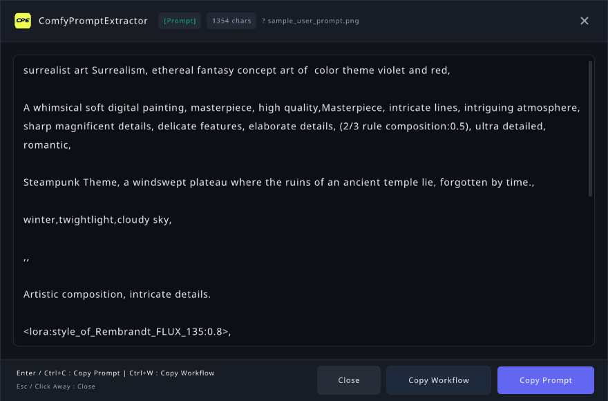

# ComfyPromptExtractor (CPE)

**ComfyPromptExtractor (CPE)** is an ultra-fast, zero-dependency C application for Linux engineered to extract clean generation prompt text and workflow metadata from ComfyUI-generated PNG images with zero startup overhead.



---

## Key Features

- 🎯 **Clean Prompt Text Extraction (Default)**: Automatically parses ComfyUI node graphs, tracing Samplers (`KSampler`, `SamplerCustom`), `CLIPTextEncode`, `SDXL` (`text_g`/`text_l`), `Flux` (`clip_l`/`t5xxl`), Guidance nodes, and text primitives to deliver **clean, raw human-readable prompt text** rather than raw JSON graphs.
- ⚡ **Instant Execution (< 1ms)**: Fast, sequential C stream parser reads only PNG chunk headers (`tEXt` and `iTXt`) and skips multi-megabyte `IDAT` pixel data with `fseek()`.
- 🔄 **Smart Context Detection**:
  - **Terminal / CLI Mode (TTY detected)**: Emits clean prompt text directly to `stdout` and exits immediately (`0` on success, `1` on error). Zero GUI initialization overhead.
  - **Desktop / GUI Mode (No TTY / File Manager)**: Launches a sleek, compact, borderless dark UI centered on screen.
- 📋 **Seamless Clipboard & Dismissal**:
  - **Copy Prompt**: Click **"Copy Prompt"**, press <kbd>Enter</kbd>, or press <kbd>Ctrl</kbd> + <kbd>C</kbd>.
  - **Copy Workflow**: Click **"Copy Workflow"** or press <kbd>Ctrl</kbd> + <kbd>W</kbd> to copy the full JSON workflow structure to the clipboard.
  - **Dismiss**: Press <kbd>Esc</kbd>, click **"Close"**, or simply click outside the window (instant close on focus loss).
- 📦 **Zero External Runtime Dependencies**: Single source file (`cpe.c`), tiny stripped binary (~960 KB), embedded lightweight JSON graph parser, and minimal Raylib GUI.
- 🗂️ **Desktop Integration**: Includes FreeDesktop `cpe.desktop` specification for "Right Click -> Open With" in Linux file managers (Nautilus, Dolphin, Thunar, Nemo, etc.) with quick actions for Negative Prompt and Workflow JSON.

---

## Installation & Building

### Prerequisites
- Standard C99 compiler (`gcc` or `clang`)
- `make`
- Basic X11 / OpenGL development libraries (`libx11`, `libgl`)

### Compile
```bash
# Clone repository
git clone https://github.com/JRufer/ComfyPromptExtractor.git
cd ComfyPromptExtractor

# Compile optimized binary
make
```

### Install System-Wide (or User-Local)
```bash
# Install to /usr/local/bin and install desktop handler
sudo make install

# Or install to user directory (~/.local)
make install PREFIX=~/.local
```

---

## Usage

### CLI Mode (Terminal)
When invoked from a terminal or shell pipeline, CPE automatically operates in CLI mode:

```bash
# Extract clean positive prompt text (default)
cpe image.png

# Extract negative prompt text
cpe -n image.png

# Extract raw prompt JSON graph
cpe -r image.png | jq .

# Extract raw ComfyUI workflow JSON
cpe -w image.png | jq .

# Force CLI mode in scripts
cpe --cli image.png > prompt.txt
```

### GUI Mode (Desktop / File Manager)
- **Desktop**: Right-click any ComfyUI PNG image in your file manager and select **"Open With -> ComfyPromptExtractor"**.
- **Terminal (Forced GUI)**:
  ```bash
  cpe --gui image.png
  ```

### Keyboard Shortcuts in GUI

| Shortcut | Action |
| :--- | :--- |
| <kbd>Enter</kbd> or <kbd>KP_Enter</kbd> | Copy prompt text to clipboard and exit |
| <kbd>Ctrl</kbd> + <kbd>C</kbd> | Copy prompt text to clipboard and exit |
| <kbd>Ctrl</kbd> + <kbd>W</kbd> | Copy entire workflow JSON structure to clipboard and exit |
| <kbd>Esc</kbd> | Close window without copying |
| <kbd>Click Away</kbd> | Close window immediately on focus loss |
| <kbd>Mouse Wheel</kbd> / <kbd>↑</kbd> <kbd>↓</kbd> | Scroll wrapped text |
| <kbd>Page Up</kbd> / <kbd>Page Down</kbd> | Scroll by page |

---

## Options Reference

```text
ComfyPromptExtractor (CPE) v1.1.0
Usage: cpe [options] <image.png>

Options:
  -p, --prompt       Extract clean prompt text (default)
  -n, --negative     Extract negative prompt text
  -r, --raw          Extract raw prompt JSON metadata graph
  -w, --workflow     Extract raw workflow JSON metadata
      --cli          Force CLI mode (print text directly to stdout)
      --gui          Force GUI mode (open compact UI window)
  -h, --help         Show this help message
  -v, --version      Show version information
```

---

## Running Tests & Benchmarks

```bash
# Run automated test suite
make test
```

### Benchmark Comparison
```bash
$ time cpe tests/sample_user_prompt.png > /dev/null
real    0m0.001s
user    0m0.001s
sys     0m0.000s
```

---

## License
MIT License
